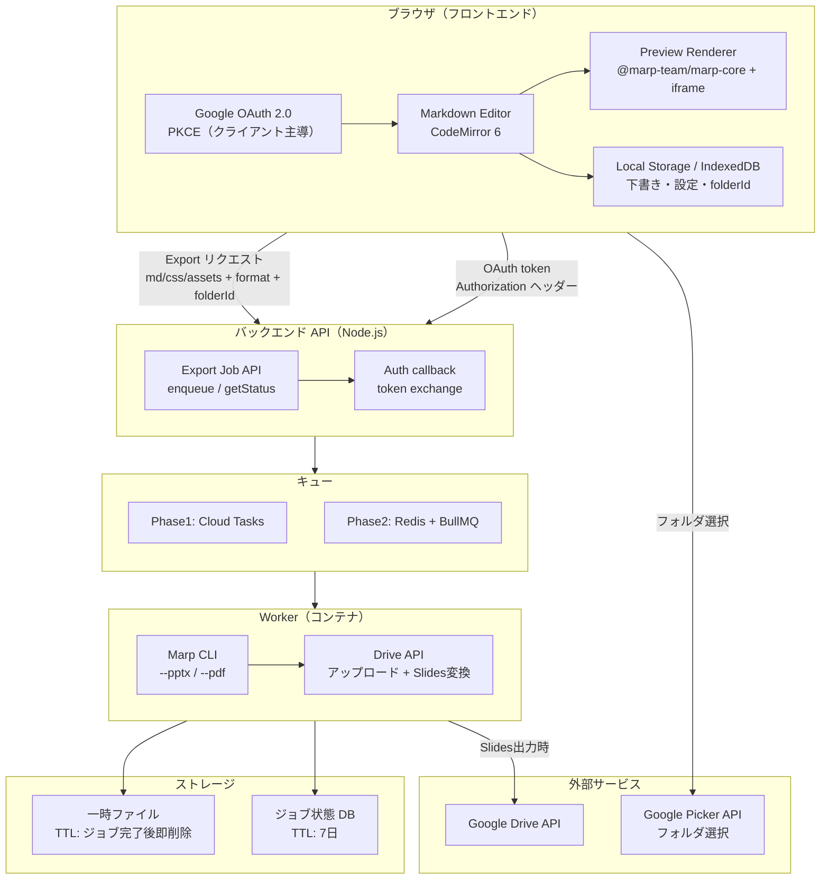
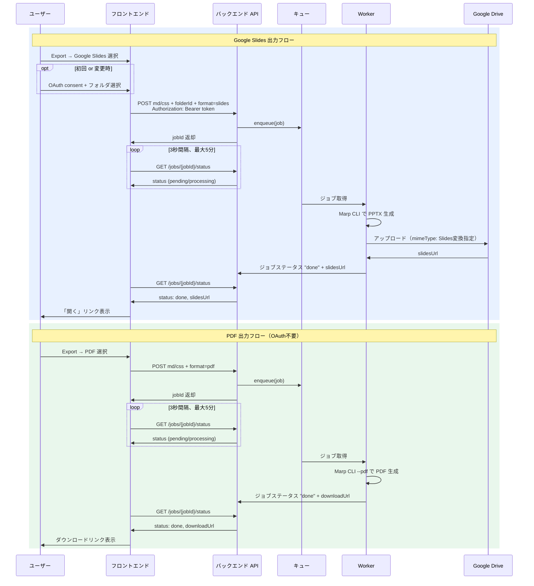
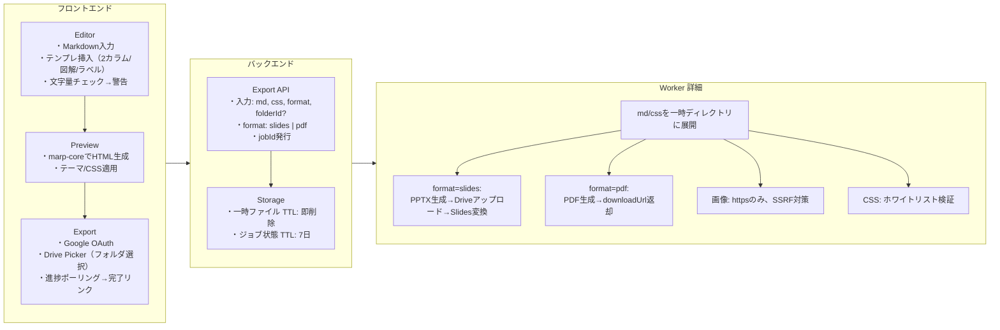

# MD2slide アーキテクチャ図

要件定義・技術スタック・アーキテクチャに基づく図です。Markdown プレビュー（GitHub、VS Code 等）で Mermaid がレンダリングされます。

---

## 1. システムアーキテクチャ

```mermaid
flowchart TB
    subgraph Browser["ブラウザ（フロントエンド）"]
        Editor["Markdown Editor<br/>CodeMirror 6"]
        Preview["Preview Renderer<br/>@marp-team/marp-core + iframe"]
        LocalStorage["Local Storage / IndexedDB<br/>下書き・設定・folderId"]
        OAuth["Google OAuth 2.0<br/>PKCE（クライアント主導）"]
        Editor --> Preview
        Editor --> LocalStorage
        OAuth --> Editor
    end

    subgraph Backend["バックエンド API（Node.js）"]
        ExportAPI["Export Job API<br/>enqueue / getStatus"]
        Auth["Auth callback<br/>token exchange"]
        ExportAPI --> Auth
    end

    subgraph Queue["キュー"]
        direction TB
        Phase1["Phase1: Cloud Tasks"]
        Phase2["Phase2: Redis + BullMQ"]
    end

    subgraph Worker["Worker（コンテナ）"]
        MarpCLI["Marp CLI<br/>--pptx / --pdf"]
        DriveUpload["Drive API<br/>アップロード + Slides変換"]
        MarpCLI --> DriveUpload
    end

    subgraph External["外部サービス"]
        Drive["Google Drive API"]
        Picker["Google Picker API<br/>フォルダ選択"]
    end

    subgraph Storage["ストレージ"]
        TempFiles["一時ファイル<br/>TTL: ジョブ完了後即削除"]
        JobDB["ジョブ状態 DB<br/>TTL: 7日"]
    end

    Browser -->|"Export リクエスト<br/>md/css/assets + format + folderId"| Backend
    Backend --> Queue
    Queue --> Worker
    Worker -->|"Slides出力時"| Drive
    Worker --> TempFiles
    Worker --> JobDB
    Browser -->|"フォルダ選択"| Picker
    Browser -->|"OAuth token<br/>Authorization ヘッダー"| Backend
```

---

## 2. エクスポートフロー（シーケンス図）

```mermaid
sequenceDiagram
    participant User as ユーザー
    participant Frontend as フロントエンド
    participant Backend as バックエンド API
    participant Queue as キュー
    participant Worker as Worker
    participant Drive as Google Drive

    rect rgb(232, 241, 255)
        Note over User,Drive: Google Slides 出力フロー
        User->>Frontend: Export → Google Slides 選択
        opt 初回 or 変更時
            User->>Frontend: OAuth consent + フォルダ選択
        end
        Frontend->>Backend: POST md/css + folderId + format=slides<br/>Authorization: Bearer token
        Backend->>Queue: enqueue(job)
        Backend->>Frontend: jobId 返却
        loop 3秒間隔、最大5分
            Frontend->>Backend: GET /jobs/{jobId}/status
            Backend->>Frontend: status (pending/processing)
        end
        Queue->>Worker: ジョブ取得
        Worker->>Worker: Marp CLI で PPTX 生成
        Worker->>Drive: アップロード（mimeType: Slides変換指定）
        Drive->>Worker: slidesUrl
        Worker->>Backend: ジョブステータス "done" + slidesUrl
        Frontend->>Backend: GET /jobs/{jobId}/status
        Backend->>Frontend: status: done, slidesUrl
        Frontend->>User: 「開く」リンク表示
    end

    rect rgb(233, 247, 236)
        Note over User,Drive: PDF 出力フロー（OAuth不要）
        User->>Frontend: Export → PDF 選択
        Frontend->>Backend: POST md/css + format=pdf
        Backend->>Queue: enqueue(job)
        Backend->>Frontend: jobId 返却
        loop 3秒間隔、最大5分
            Frontend->>Backend: GET /jobs/{jobId}/status
            Backend->>Frontend: status (pending/processing)
        end
        Queue->>Worker: ジョブ取得
        Worker->>Worker: Marp CLI --pdf で PDF 生成
        Worker->>Backend: ジョブステータス "done" + downloadUrl
        Frontend->>Backend: GET /jobs/{jobId}/status
        Backend->>Frontend: status: done, downloadUrl
        Frontend->>User: ダウンロードリンク表示
    end
```

---

## 3. コンポーネント詳細

```mermaid
flowchart LR
    subgraph Frontend["フロントエンド"]
        direction TB
        Editor["Editor<br/>・Markdown入力<br/>・テンプレ挿入（2カラム/図解/ラベル）<br/>・文字量チェック→警告"]
        Preview["Preview<br/>・marp-coreでHTML生成<br/>・テーマ/CSS適用"]
        Export["Export<br/>・Google OAuth<br/>・Drive Picker（フォルダ選択）<br/>・進捗ポーリング→完了リンク"]
        Editor --> Preview
        Preview --> Export
    end

    subgraph Backend["バックエンド"]
        direction TB
        ExportAPI["Export API<br/>・入力: md, css, format, folderId?<br/>・format: slides | pdf<br/>・jobId発行"]
        Storage["Storage<br/>・一時ファイル TTL: 即削除<br/>・ジョブ状態 TTL: 7日"]
        ExportAPI --> Storage
    end

    subgraph WorkerDetail["Worker 詳細"]
        direction TB
        W1["md/cssを一時ディレクトリに展開"]
        W2["format=slides:<br/>PPTX生成→Driveアップロード→Slides変換"]
        W3["format=pdf:<br/>PDF生成→downloadUrl返却"]
        W4["画像: httpsのみ、SSRF対策"]
        W5["CSS: ホワイトリスト検証"]
        W1 --> W2
        W1 --> W3
        W1 --> W4
        W1 --> W5
    end

    Frontend --> Backend
    Backend --> WorkerDetail
```
